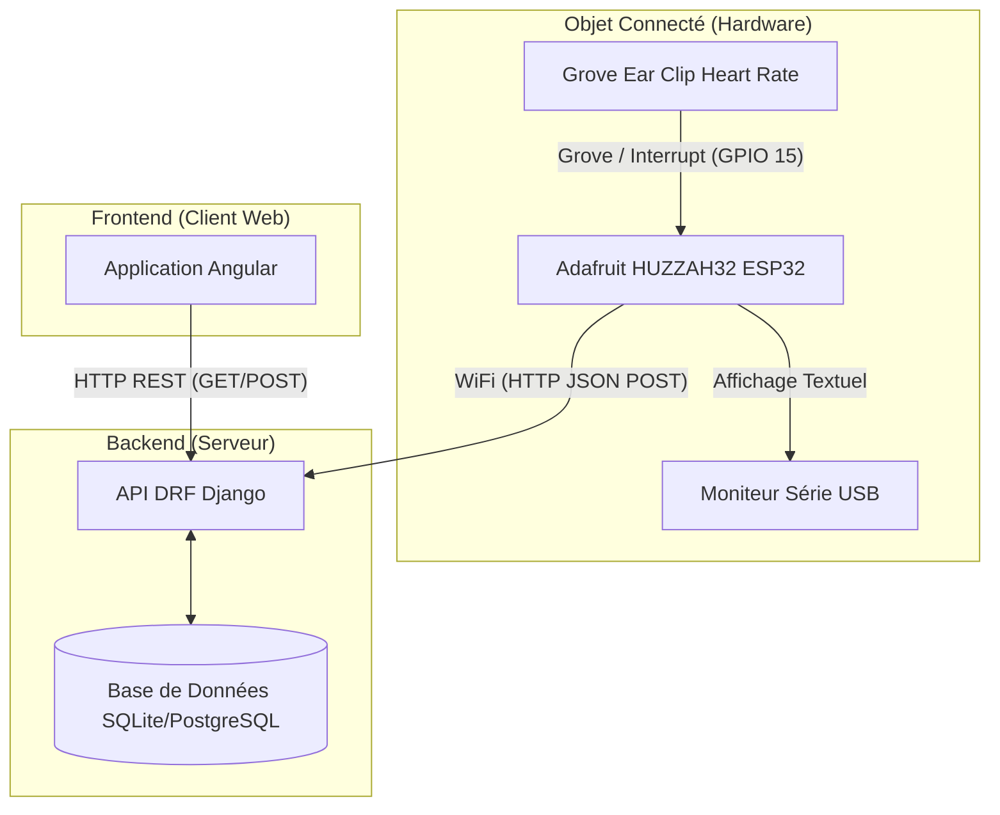

# 🕵️‍♂️ Détecteur de Mensonges Connecté (Web of Things)

Ce projet universitaire a pour but de concevoir et développer un détecteur de mensonges connecté utilisant une carte **Adafruit HUZZAH32 (ESP32 Feather)** avec un capteur de rythme cardiaque (Grove Ear Clip), une API Backend sous Django REST Framework (DRF) et une interface Frontend développée avec Angular.

---

## 🏗️ 1. Architecture du Système

### Diagramme de Déploiement



---

## 📖 2. Scénarios Utilisateurs

### Scénario 1 : La phase de Calibration
L'utilisateur accroche le capteur (Grove Ear Clip) sur l'oreille ou le doigt. L'objet est pour l'instant dans un état autonome.
L'utilisateur envoie la lettre `c` dans le Moniteur Série pour lancer la séquence.
Le Moniteur Série affiche "Calibration en cours...". Durant 10 secondes, le microcontrôleur lit les pulsations via une interruption matérielle et calcule la moyenne du rythme cardiaque (BPM) au repos. Une fois terminé, l'objet enregistre cette valeur (ex: `70 BPM`) en mémoire interne comme "Rythme de Base". Le Moniteur affiche "Prêt pour le test".

### Scénario 2 : Le Test de Vérité
L'utilisateur est interrogé (test de mensonge). Le dispositif est connecté au WiFi. 
Le HUZZAH32 lit le rythme cardiaque en continu et le compare à la valeur de calibration :
- Si le BPM instantané est inférieur ou égal à `Rythme de Base + 20%` (ex: `<= 84 BPM`), l'utilisateur est jugé calme. L'objet envoie l'information au serveur backend sous format JSON signalant l'état `vérité` et le `bpm_actuel`.
- Si le BPM dépasse le seuil de 20%, l'utilisateur est probablement stressé en mentant. Une ligne d'alerte apparaît sur le Moniteur Série. Une requête HTTP POST est envoyée à l'API pour logger le changement d'état suspect.
Le Frontend Angular connecté au Backend observe ces données et le tableau de bord affiche à l'écran l'alerte de "Mensonge Détecté" en temps réel.

---

## 📡 3. Définition de l'API REST

Voici la liste des endpoints exposés par l'API Django DRF :

| Route | Méthode | Rôle |
|-------|---------|------|
| `/api/users/register/` | `POST` | Inscription d'un utilisateur. |
| `/api/users/login/` | `POST` | Connexion et récupération de token. |
| `/api/devices/` | `GET` | Liste les appareils (M5StickC) enregistrés par l'utilisateur connecté. |
| `/api/devices/` | `POST` | Enregistre un nouvel appareil sur le compte utilisateur. |
| `/api/sessions/` | `POST` | Crée une nouvelle session de test de mensonge (calibration de début). |
| `/api/measures/` | `POST` | (Appelée par l'ESP32) Ajoute une nouvelle mesure de BPM liée à une session. |
| `/api/sessions/<id>/measures/` | `GET` | (Appelée par Angular) Récupère l'historique des mesures pour la session `<id>`. |

### Exemples de Payloads JSON

**1. Enregistrement d'une Mesure par l'ESP32 (`POST /api/measures/`)**

*Requête :*
```json
{
  "device_mac": "A1:B2:C3:D4:E5:F6",
  "bpm": 95,
  "base_bpm": 70,
  "is_lie": true
}
```

*Réponse (201 Created) :*
```json
{
  "id": 142,
  "message": "Measure successfully recorded."
}
```

---

## 🛠️ 4. Manuel d'Installation et d'Utilisation

Ce manuel détaille la mise en place de l'intégralité de la Stack Technologique.

### A. Serveur Backend (Django DRF)

1. Ouvrir le terminal dans le dossier `backend/`.
2. L'environnement virtuel est déjà prêt (s'il ne l'est pas, créer avec `python -m venv venv`). L'activer :
   ```bash
   # Sur Windows :
   .\\venv\\Scripts\\activate
   # Sur Linux/Mac :
   source venv/bin/activate
   ```
3. Installer les dépendances (Django, DRF, CORS Headers) si nécessaire :
   ```bash
   pip install django djangorestframework django-cors-headers
   ```
4. Appliquer les migrations de la base de données :
   ```bash
   python manage.py makemigrations
   python manage.py migrate
   ```
5. Créer un super administrateur (Optionnel mais recommandé) :
   ```bash
   python manage.py createsuperuser
   ```
6. Lancer le serveur backend :
   ```bash
   python manage.py runserver 0.0.0.0:8000
   ```
   *(NB : L'écoute sur `0.0.0.0` permet au HUZZAH32 d'accéder à l'API via l'IP locale du PC).*

### B. Client Frontend (Angular)

1. Ouvrir un terminal dans le dossier `frontend/`.
2. Installer les modules Node.js (dont TailwindCSS) :
   ```bash
   npm install
   ```
3. Lancer le serveur de développement :
   ```bash
   npm start
   ```
   *L'application sera accessible sur `http://localhost:4200`.*

### C. Hardware (Adafruit HUZZAH32 - Arduino IDE)

Ce projet utilise la carte **Adafruit HUZZAH32 ESP32 Feather** et le capteur **Grove Ear Clip Heart Rate Sensor**. L'interface utilisateur repose uniquement sur le Moniteur Série.

**🛠️ 1. Branchement du Matériel :**
- **Capteur Cardiaque (Grove)** : Connectez la broche de signal (jaune) au **Pin 15** du HUZZAH32. Branchez le VCC au "3V" et le GND au "GND".

**🖥️ 2. Préparation de l'IDE :** 
1. **Télécharger** [Arduino IDE](https://www.arduino.cc/en/software).
2. Ajouter le gestionnaire de cartes pour ESP32 : 
   - Allez dans `Fichier > Préférences`.
   - Dans "URL de gestionnaire de cartes supplémentaires", ajoutez : `https://espressif.github.io/arduino-esp32/package_esp32_index.json`
3. Allez dans `Outils > Type de carte > Gestionnaire de cartes`. Cherchez **esp32** par Espressif Systems et installez-le.
4. Sélectionnez la carte : `Outils > Type de carte > ESP32 Arduino > Adafruit ESP32 Feather`.
5. Sélectionnez le Port COM de votre carte préalablement branchée en USB.

**📚 3. Bibliothèques à installer :**
Allez dans `Croquis > Inclure une bibliothèque > Gérer les bibliothèques...` :
- Recherchez et installez **`ArduinoJson`** (par Benoit Blanchon - version 6.x ou 7.x).
*(Note: Le capteur et l'ESP32 n'ont besoin d'aucune autre bibliothèque externe ici).*

**🚀 4. Compilation et Flash :**
1. Ouvrir le fichier `arduino/detecteur_mensonge/detecteur_mensonge.ino`.
2. Modifier LIGNES 5 à 7 au début du fichier :
   - `SSID` : Nom de votre réseau WiFi.
   - `PASSWORD` : Mot de passe de votre WiFi.
   - `API_URL` : Remplacez par `http://YOUR_IP:8000/api/measures/` (IP locale de l'ordinateur qui fait tourner Django). Obtenez votre IP locale via `ipconfig` en terminal Windows.
3. Cliquez sur le bouton ☑️ **Vérifier** puis ➡️ **Téléverser**.

### D. Guide d'Usage (Pas-à-Pas de la solution)

1. **Démarrage Central** : Assurez-vous que le serveur Django et Angular tournent.
2. **Initialisation de l'Objet** : Allumez le Adafruit HUZZAH32 branché à l'ordinateur. Ouvrez le Moniteur Série sur 115200 baud pour voir l'IP. Assurez-vous qu'il parvient à se connecter au réseau WiFi.
3. **Mise en route du Dashboard** : Connectez-vous sur Angular (`http://localhost:4200`). Allez sur l'onglet "Dashboard".
4. **Calibration** : Accrochez le Grove Ear Clip à votre oreille ou votre doigt. Entrez simplement la lettre `c` dans le Moniteur Série pour lancer. Patientez 10 secondes.
5. **Phase de Test** : Le test commence. Répondez aux questions posées par un interrogateur. 
6. **Mise à jour en temps réel** : Si votre BPM bondit, la mesure synchronisée apparaîtra dans l'historique de votre Dashboard Angular en marquant une alerte visuelle ROUGE.
