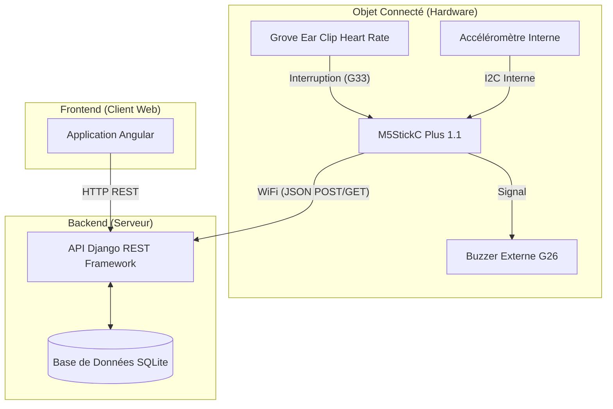

Ce projet universitaire a pour but de concevoir et développer un détecteur de mensonges connecté utilisant une carte M5StickC Plus 1.1 (compatible ESP32), un capteur de rythme cardiaque (Grove Ear Clip), une API Backend sous Django REST Framework (DRF) et une interface Frontend développée avec Angular.

---

## 1. Objectifs et Contraintes du Projet

Ce projet s'inscrit dans le cadre de l'implémentation d'un objet connecté (Web of Things - WoT). Il répond aux contraintes techniques suivantes :

### Contraintes Hardware
- **Microcontrôleur** : Utilisation d'une carte à base d'ESP32 (M5StickC Plus 1.1 utilisée ici comme alternative au Feather HUZZAH32).
- **Capteurs** : Au moins deux capteurs sont intégrés :
    1. **Rythme cardiaque** : Capteur Grove Ear Clip Heart Rate (Pin G33).
    2. **Tremblements** : Accéléromètre (IMU intégré) pour détecter le stress physique.
- **Actionneur** : Au moins un actionneur est utilisé :
    1. **Buzzer externe** (Pin G26) : Déclenché par l'API en cas de mensonge détecté.
    2. **Écran LCD** : Affichage des états en temps réel.

### Contraintes de Connectivité et d'Architecture
- **Communication Bidirectionnelle** : 
    - L'objet envoie des mesures (BPM, vibrations) au serveur via HTTP POST.
    - L'objet interroge l'API via HTTP GET pour recevoir des ordres (activation du buzzer).
- **Gestion de Données** : Centralisation sur un serveur backend avec stockage en base de données pour l'historique.
- **Interface Web** : Application Angular permettant la visualisation des données et le contrôle distant.

---

## 2. Architecture du Système

### Diagramme de Déploiement


```mermaid
graph TD
    subgraph "Objet Connecté (Hardware)"
        ESP32[M5StickC Plus 1.1]
        Capteur_Pulse[Grove Ear Clip Heart Rate]
        IMU[Accéléromètre Interne]
        Buzzer[Buzzer Externe G26]
        
        Capteur_Pulse -- Interruption (G33) --> ESP32
        IMU -- I2C Interne --> ESP32
        ESP32 -- Signal --> Buzzer
    end

    subgraph "Backend (Serveur)"
        API[API Django REST Framework]
        BDD[(Base de Données SQLite)]
        API <--> BDD
    end

    subgraph "Frontend (Client Web)"
        App[Application Angular]
    end

    ESP32 -- "WiFi (JSON POST/GET)" --> API
    App -- "HTTP REST" --> API
```

---

## 3. Scénarios Utilisateurs

### Scénario 1 : Phase de Calibration
L'utilisateur place le capteur (Grove Ear Clip). En appuyant sur le bouton principal (M5) de l'appareil, une séquence de 10 secondes démarre pour calculer le rythme cardiaque de base au repos. Le système affiche "CALIBRATION..." sur l'écran. Une fois terminée, la valeur de base est enregistrée et l'objet est prêt pour le test.

### Scénario 2 : Test de Vérité et Alerte
Durant l'interrogatoire, le M5StickC lit en continu le BPM et l'intensité des tremblements. 
- Si l'utilisateur reste calme, l'état reste "Vérité".
- Si le BPM dépasse le seuil de calibration ou si des tremblements sont détectés, l'information est envoyée au serveur.
- Le backend analyse les données et met à jour l'état du "device". 
- L'objet interroge périodiquement le serveur. Si un mensonge est confirmé, le buzzer externe s'active avec une séquence sonore d'alerte spécifique.
- Le dashboard Angular affiche une alerte visuelle rouge en temps réel.

---

## 4. Définition de l'API REST

Liste des points de terminaison (endpoints) exposés par l'API Django :

| Route | Méthode | Rôle |
|-------|---------|------|
| `/api/users/register/` | `POST` | Inscription d'un utilisateur. |
| `/api/users/login/` | `POST` | Connexion et récupération de token. |
| `/api/devices/` | `GET` | Liste des appareils enregistrés. |
| `/api/measures/` | `POST` | Envoi des mesures (BPM, Shake) par l'ESP32. |
| `/api/devices/status/` | `GET` | Vérification de l'état (is_lie) pour l'actuateur. |

### Exemple de payload (Mesure)
```json
{
  "device_mac": "A1:B2:C3:D4:E5:F6",
  "bpm": 95,
  "base_bpm": 70,
  "shake_intensity": 0.85
}
```

---

## 5. Livrables du Projet

Conformément aux exigences, le projet inclut :
1. **Code Source** : Intégralité du projet (Hardware, Backend, Frontend) sur le dépôt Git.
2. **Démonstration Vidéo** : Vidéo de 1-3 minutes présentant le prototype fonctionnel.
3. **Rapport de Projet** : Document détaillant l'architecture, le protocole de communication, le schéma de câblage et le journal de bord.

---

## 6. Manuel d'Installation

### Backend (Django)
1. Accéder au dossier `backend/`.
2. Activer l'environnement virtuel (`venv\Scripts\activate`).
3. Installer les dépendances : `pip install -r requirements.txt` (ou manuellement : `django djangorestframework django-cors-headers`).
4. Lancer le serveur : `python manage.py runserver 0.0.0.0:8000`.

### Frontend (Angular)
1. Accéder au dossier `frontend/`.
2. Installer les modules : `npm install`.
3. Lancer l'application : `npm start`.

### Hardware (M5StickC Plus)
1. Utiliser Arduino IDE avec les bibliothèques `M5StickCPlus`, `M5Unified` et `ArduinoJson`.
2. Configurer le SSID/PASSWORD du WiFi et l'IP du serveur dans le fichier `.ino`.
3. Téléverser le code sur la carte.
